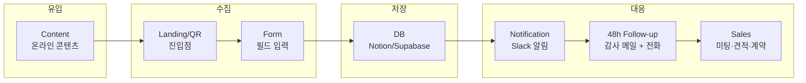
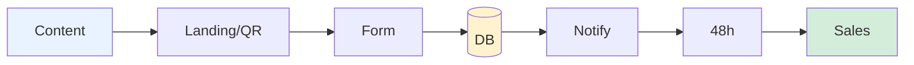
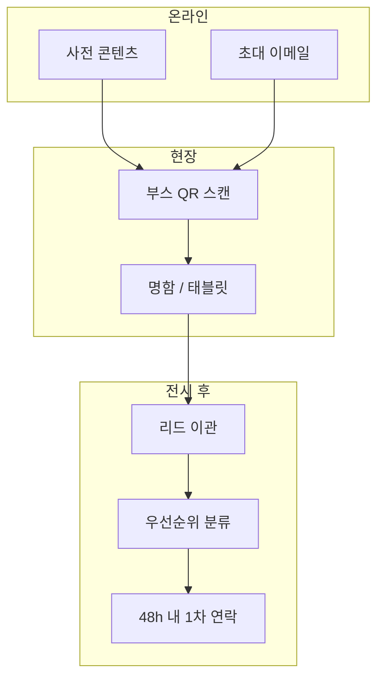

# Lead Flow Diagram

리드가 수집·전달·후속까지 흐르는 파이프라인 Blueprint.

---

## 단계별 파이프라인

**요약**
- Content → Landing/QR → Form → DB → Notification → 48h Follow-up → Sales 순서로 흐름.
- 48시간 내 후속이 기본 기준.
- DB 이후 알림·할당은 자동화 권장.

---

## 수평 파이프라인 (간소화)

**요약**
- 파랑: 유입 / 노랑: 저장 / 초록: 전환.
- Form → DB → Notify 구간은 자동화하여 수동 작업 최소화.

---

## KOBA 현장 흐름

**요약**
- 온라인(사전 콘텐츠·초대) → 현장(QR·명함) → 전시 후(이관·분류·48h 연락).
- D-day 종료 시 당일 리드 이관, D+2 내 연락 완료 목표.
