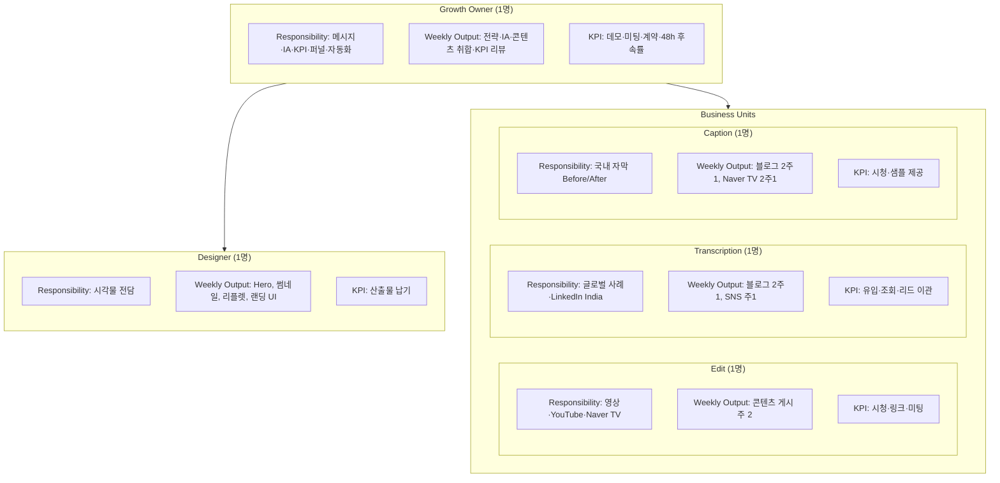
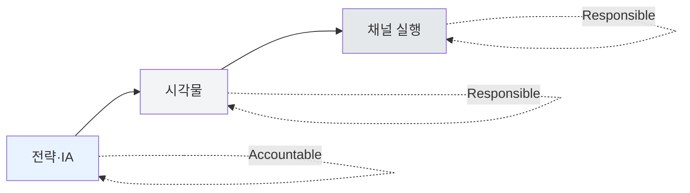

# Role Ownership Map

역할별 책임·산출물·KPI를 한눈에 보는 조직도 Blueprint.

---

## 조직 구조

**요약**
- Growth Owner는 전략·구조·KPI·자동화를 담당하고, Designer·사업부는 실행.
- Designer는 시각 자산, Edit·Transcription·Caption은 채널별 콘텐츠 담당.
- R=책임, O=주간 산출, K=KPI.

---

## 책임 흐름 (RACI 관점)

**요약**
- Growth Owner: A(책임) / Designer·사업부: R(실행).
- 총괄은 전략·구조·KPI에 집중하고, 콘텐츠·채널은 사업부가 직접 운영.
