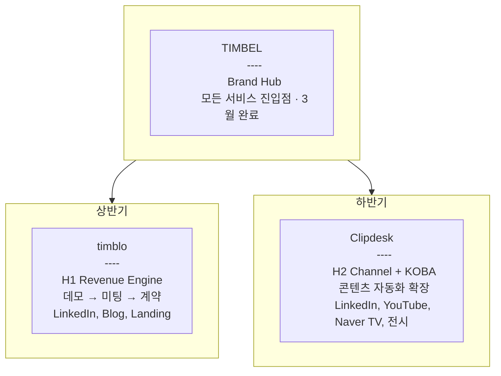
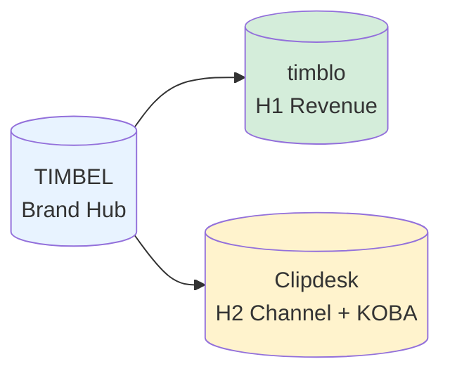

# Company System Map

회사 전체 Growth 구조를 한 장에 표현한 Blueprint.

---

## TIMBEL → timblo → Clipdesk 구조

**요약**
- TIMBEL은 상반기·하반기 모든 제품의 공통 진입점.
- timblo는 상반기 Revenue 중심, Clipdesk는 하반기 Channel + KOBA 중심.
- 동시 운영 가능하며, 시즌별로 집중도만 조정.

---

## 간소화 트리 뷰

**요약**
- 좌→우: 상위 브랜드 → 제품 단위.
- 색상: 브랜드(파랑), 상반기(초록), 하반기(노랑).
